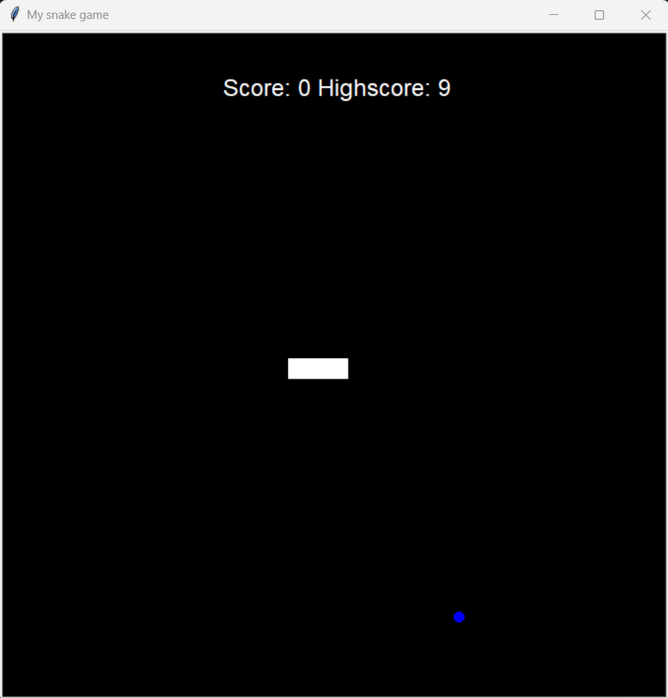

# Snake-game
A friendly Snake Game which we all have in our childhood.

This game is made using two `Python` libraries: `Turtle` and `Screen`.

## Run it via Termainal
1. Go to the destination folder in `Terminal`.
2. Run command `python3 main.py` or `python main.py`

## Here's a peek into the game

